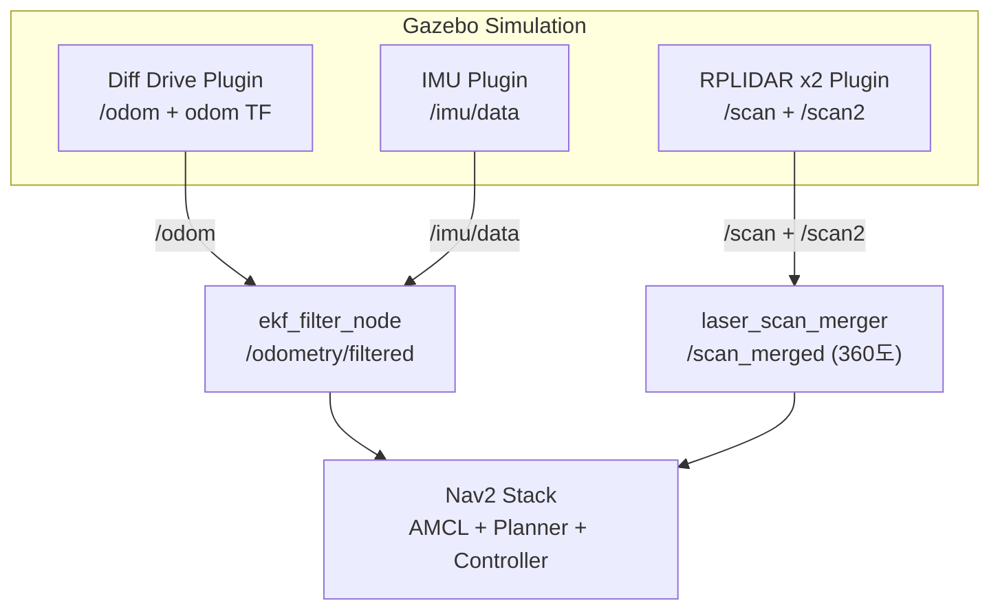
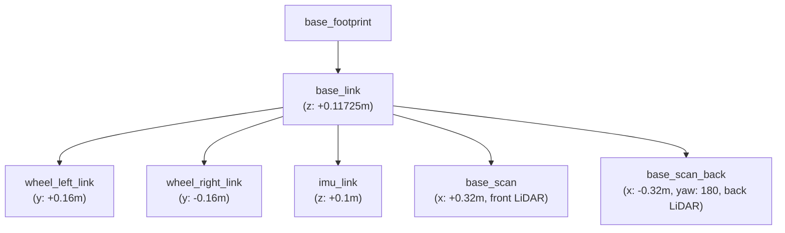

# Sendbooster AGV Simulation

ROS2 Humble + Gazebo Classic 기반 Sendbooster AGV 시뮬레이션 패키지

## 개요

이 패키지는 Sendbooster AGV의 Gazebo 시뮬레이션 환경을 제공합니다.
차동 구동 로봇, 듀얼 LiDAR, IMU, 레이저 스캔 합성, EKF 센서 융합, Nav2 네비게이션까지 시뮬레이션에서 테스트할 수 있습니다.

## 시스템 아키텍처



## 관련 레포지토리

| 레포지토리 | 설명 | 링크 |
|-----------|------|------|
| **sendbooster_agv_simulation** | 시뮬레이션 + URDF (이 패키지) | [GitHub](https://github.com/SeongminJaden/sendbooster_agv_simulation) |
| **sendbooster_agv_bringup** | 실제 로봇 통합 런치 | [GitHub](https://github.com/SeongminJaden/sendbooster_agv_bringup) |
| **2th_NtrexAHRS_lib_ROS_Sendbooster** | AHRS IMU 드라이버 (stella_ahrs) | [GitHub](https://github.com/SeongminJaden/2th_NtrexAHRS_lib_ROS_Sendbooster) |
| **serial-ros2** | ROS2 시리얼 통신 (실제 로봇용) | [GitHub](https://github.com/RoverRobotics/serial-ros2) |

## 로봇 스펙

| 항목 | 값 |
|------|-----|
| 구동 방식 | 차동 구동 (Differential Drive) |
| 로봇 크기 | 600mm x 600mm x 300mm |
| 바퀴 반지름 | 96.5mm |
| 바퀴 간격 | 320mm (시뮬레이션) |
| LiDAR | RPLIDAR A2M8 x2 (전방 + 후방) |
| LiDAR 범위 | 0.15m ~ 12m, 400 samples, 10Hz |
| LiDAR 위치 | 전방: +0.32m, 후방: -0.32m (base_link 기준) |
| IMU | 6축 IMU (base_link 상단 +0.1m) |

## 패키지 구조

```
sendbooster_agv_simulation/
├── CMakeLists.txt
├── package.xml
├── urdf/
│   └── sendbooster_agv.urdf                # 로봇 URDF (TF 정의)
├── models/
│   ├── sendbooster_agv/
│   │   ├── sendbooster_agv.sdf             # Gazebo SDF (물리/센서)
│   │   └── model.config
│   ├── sendbooster_world/                  # 시뮬레이션 월드 모델
│   ├── turtlebot3_house/                   # 하우스 환경 모델
│   └── model_stl/meshes/                  # 3D 메쉬 파일
├── worlds/
│   ├── sendbooster_agv_world.world         # 기본 월드
│   ├── sendbooster_agv_autorace.world      # 오토레이스 월드
│   └── empty_world.world                   # 빈 월드
├── launch/
│   ├── sendbooster_agv_world.launch.py     # 기본 시뮬레이션
│   ├── sendbooster_agv_house.launch.py     # 하우스 환경
│   ├── empty_world.launch.py              # 빈 환경
│   ├── spawn_sendbooster_agv.launch.py     # 로봇 스폰
│   ├── robot_state_publisher.launch.py     # URDF → TF
│   └── navigation2.launch.py              # Nav2 + EKF + 스캔 합성
├── param/
│   ├── nav2_params.yaml                    # Nav2 파라미터
│   └── ekf_config.yaml                     # EKF 설정
├── src/
│   ├── laser_scan_merger.cpp               # 듀얼 LiDAR 360도 합성
│   ├── pose_reinitializer.cpp              # AMCL 포즈 재초기화
│   └── sendbooster_agv_drive.cpp           # Gazebo 드라이브 플러그인
├── rviz/
│   └── sendbooster_agv_gazebo.rviz         # Rviz 설정
├── scripts/
│   └── localization_monitor.py             # 위치추정 모니터링
└── agv_web_control/                        # 웹 기반 AGV 제어 시스템
    ├── backend/                            # FastAPI 백엔드
    ├── frontend/                           # React 프론트엔드
    ├── docker-compose.yml
    └── README.md
```

## 설치

### 1. 시스템 패키지 설치

```bash
sudo apt update
sudo apt install -y \
  ros-humble-gazebo-ros-pkgs \
  ros-humble-robot-state-publisher \
  ros-humble-robot-localization \
  ros-humble-nav2-bringup \
  ros-humble-teleop-twist-keyboard
```

### 2. 워크스페이스 구성

```bash
mkdir -p ~/ros2_ws/src
cd ~/ros2_ws/src
git clone https://github.com/SeongminJaden/sendbooster_agv_simulation.git
```

### 3. 빌드

```bash
cd ~/ros2_ws
source /opt/ros/humble/setup.bash
rosdep install --from-paths src --ignore-src -r -y
colcon build --packages-select sendbooster_agv_simulation
source install/setup.bash
```

## 사용법

### 시뮬레이션 실행

```bash
# 기본 월드 (Gazebo + 로봇 스폰 + URDF TF)
ros2 launch sendbooster_agv_simulation sendbooster_agv_world.launch.py

# 하우스 환경
ros2 launch sendbooster_agv_simulation sendbooster_agv_house.launch.py

# 빈 환경
ros2 launch sendbooster_agv_simulation empty_world.launch.py

# 스폰 위치 지정
ros2 launch sendbooster_agv_simulation sendbooster_agv_world.launch.py \
  x_pose:=-2.0 y_pose:=-0.5
```

### 네비게이션 실행

```bash
# 1. 시뮬레이션 먼저 실행 (별도 터미널)
ros2 launch sendbooster_agv_simulation sendbooster_agv_world.launch.py

# 2. Nav2 + EKF + 스캔 합성 실행
ros2 launch sendbooster_agv_simulation navigation2.launch.py

# 커스텀 맵 사용
ros2 launch sendbooster_agv_simulation navigation2.launch.py \
  map:=/path/to/your/map.yaml
```

### 텔레옵 테스트

```bash
ros2 run teleop_twist_keyboard teleop_twist_keyboard
# i: 전진, ,: 후진, j: 좌회전, l: 우회전, k: 정지
```

### 웹 기반 제어

```bash
cd ~/ros2_ws/src/sendbooster_agv_simulation/agv_web_control
./start.sh
# 브라우저에서 http://localhost:3000 접속
```

자세한 내용은 [agv_web_control/README.md](agv_web_control/README.md)를 참고하세요.

## URDF / TF 트리

이 패키지의 URDF는 시뮬레이션과 실제 로봇 모두에서 사용됩니다.
실제 로봇의 bringup 패키지에서 이 URDF를 로드하여 static TF를 발행합니다.



## Gazebo 센서 설정 (SDF)

| 센서 | 토픽 | 프레임 | FOV | 해상도 | 주파수 |
|------|------|--------|-----|--------|--------|
| Front RPLIDAR | `/scan` | `base_scan` | 180도 | 400 samples | 10Hz |
| Back RPLIDAR | `/scan2` | `base_scan_back` | 180도 | 400 samples | 10Hz |
| IMU | `/imu/data` | `imu_link` | - | - | - |

## 시뮬레이션 vs 실제 로봇

| 항목 | 시뮬레이션 (이 패키지) | 실제 로봇 (bringup) |
|------|---------------------|-------------------|
| 모터 제어 | Gazebo diff_drive 플러그인 | MDROBOT MD400T RS485 |
| LiDAR | Gazebo ray sensor 플러그인 | rplidar_ros 드라이버 |
| IMU | Gazebo IMU 플러그인 | stella_ahrs 드라이버 |
| 스캔 합성 | laser_scan_merger (이 패키지) | laser_scan_merger (bringup) |
| EKF | param/ekf_config.yaml | config/ekf.yaml |
| Nav2 | param/nav2_params.yaml | config/nav2_params.yaml |
| URDF | 공유 (이 패키지에서 정의) | 공유 (이 패키지에서 로드) |
| use_sim_time | true | false |

## ROS2 토픽 (시뮬레이션)

### Published Topics

| Topic | Type | 발행 노드 | 설명 |
|-------|------|----------|------|
| `/odom` | nav_msgs/Odometry | Gazebo diff_drive | 휠 오도메트리 |
| `/imu/data` | sensor_msgs/Imu | Gazebo IMU | IMU 데이터 |
| `/odometry/filtered` | nav_msgs/Odometry | ekf_filter_node | EKF 융합 오도메트리 |
| `/scan` | sensor_msgs/LaserScan | Gazebo ray sensor | 전방 LiDAR |
| `/scan2` | sensor_msgs/LaserScan | Gazebo ray sensor | 후방 LiDAR |
| `/scan_merged` | sensor_msgs/LaserScan | laser_scan_merger | 합성 스캔 (360도) |

### Subscribed Topics

| Topic | Type | 구독 노드 | 설명 |
|-------|------|----------|------|
| `/cmd_vel` | geometry_msgs/Twist | Gazebo diff_drive | 속도 명령 |

## 참고 자료

- [Gazebo Classic Tutorials](https://classic.gazebosim.org/tutorials)
- [Nav2 Documentation](https://docs.nav2.org/)
- [robot_localization (EKF)](https://docs.ros.org/en/humble/p/robot_localization/)
- [RPLIDAR A2M8 Datasheet](https://www.slamtec.com/en/Lidar/A2)

## 라이선스

Apache-2.0
