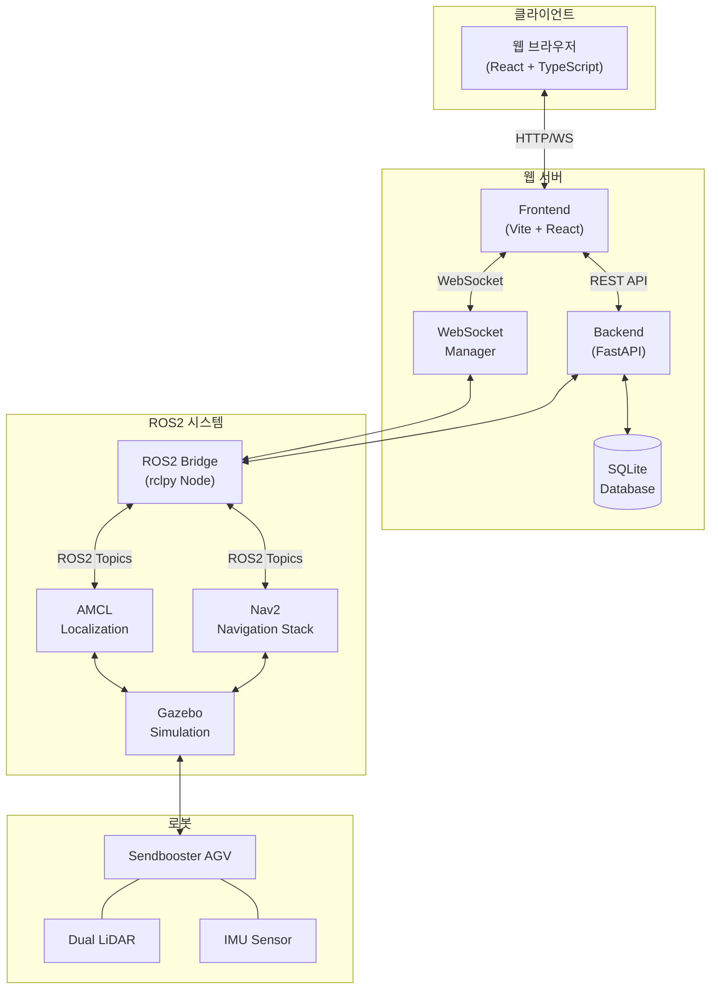
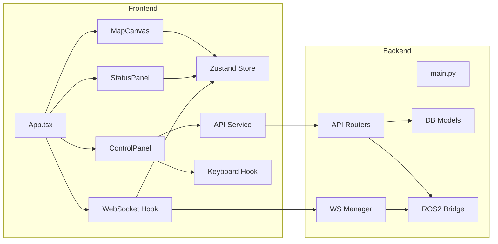
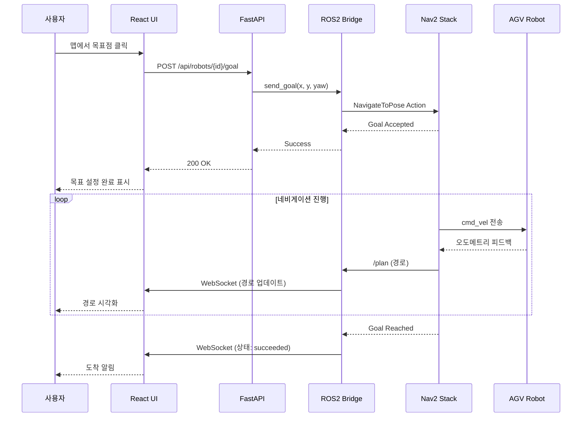
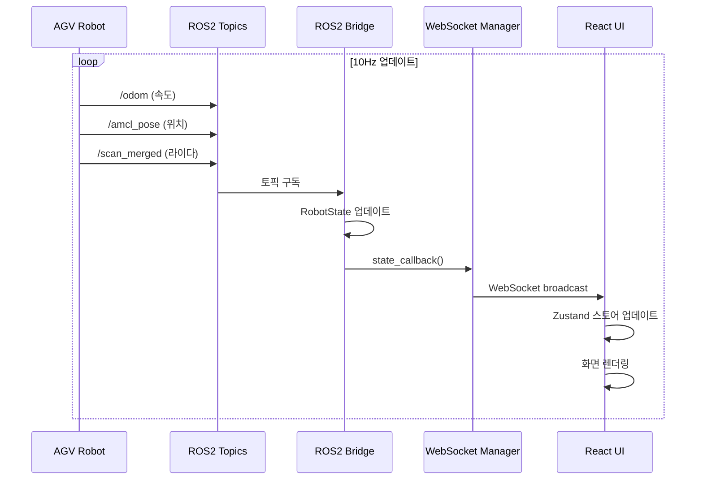
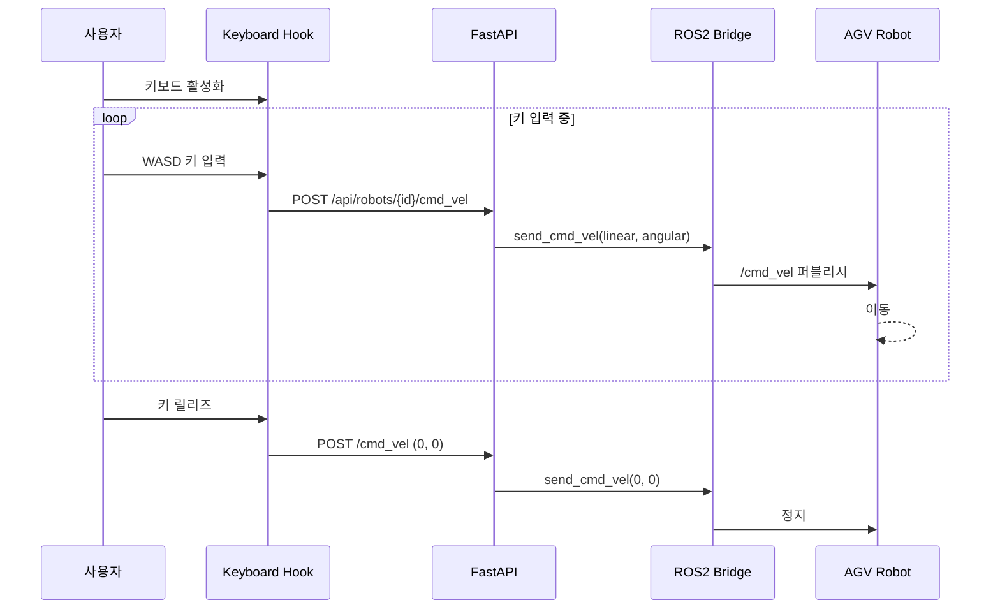

# AGV Web Control System

웹 기반 AGV(Autonomous Guided Vehicle) 관제 시스템으로, ROS2 Nav2 네비게이션과 연동하여 실시간 로봇 모니터링 및 제어가 가능합니다.

---

## 목차

- [기술 스택](#기술-스택)
- [시스템 아키텍처](#시스템-아키텍처)
- [프로젝트 구조](#프로젝트-구조)
- [시퀀스 다이어그램](#시퀀스-다이어그램)
- [설치 요구사항](#설치-요구사항)
- [설치 방법](#설치-방법)
- [실행 방법](#실행-방법)
- [화면 설계서](#화면-설계서)
- [API 문서](#api-문서)

---

## 기술 스택

### Backend
| 기술 | 버전 | 설명 |
|------|------|------|
| Python | 3.10+ | 메인 언어 |
| FastAPI | 0.104+ | 비동기 웹 프레임워크 |
| ROS2 | Humble | 로봇 운영 체제 |
| SQLAlchemy | 2.0+ | ORM |
| SQLite | 3 | 데이터베이스 |
| WebSocket | - | 실시간 통신 |
| rclpy | - | ROS2 Python 클라이언트 |

### Frontend
| 기술 | 버전 | 설명 |
|------|------|------|
| React | 18 | UI 라이브러리 |
| TypeScript | 5.0+ | 정적 타입 언어 |
| Vite | 5.0+ | 빌드 도구 |
| Zustand | 4.0+ | 상태 관리 |
| Tailwind CSS | 3.0+ | CSS 프레임워크 |
| React-Konva | 18+ | 캔버스 라이브러리 |
| Axios | 1.6+ | HTTP 클라이언트 |
| Lucide React | - | 아이콘 라이브러리 |

### Infrastructure
| 기술 | 설명 |
|------|------|
| Docker | 컨테이너화 |
| Docker Compose | 멀티 컨테이너 관리 |
| Gazebo | 로봇 시뮬레이션 |
| Nav2 | ROS2 네비게이션 스택 |

---

## 시스템 아키텍처



### 컴포넌트 아키텍처



---

## 프로젝트 구조

```
agv_web_control/
├── backend/
│   ├── main.py                 # FastAPI 앱 엔트리포인트
│   ├── config.py               # 설정 (경로, 토픽, 포트 등)
│   ├── database.py             # SQLAlchemy DB 연결
│   ├── Dockerfile              # 백엔드 Docker 이미지
│   ├── requirements.txt        # Python 의존성
│   ├── models/                 # 데이터베이스 모델
│   │   ├── __init__.py
│   │   ├── map.py              # 맵 모델
│   │   ├── robot.py            # 로봇 모델
│   │   ├── task.py             # 작업 모델
│   │   └── history.py          # 이력 모델
│   ├── routers/                # API 라우터
│   │   ├── __init__.py
│   │   ├── maps.py             # 맵 API
│   │   ├── robots.py           # 로봇 제어 API
│   │   ├── tasks.py            # 작업 API
│   │   └── history.py          # 이력 API
│   ├── ros2_bridge/            # ROS2 브릿지
│   │   ├── __init__.py
│   │   ├── node.py             # ROS2 노드 (토픽 구독/발행)
│   │   └── robot_state.py      # 로봇 상태 클래스
│   └── websocket/              # WebSocket 관리
│       ├── __init__.py
│       └── manager.py          # 연결 관리 및 브로드캐스트
│
├── frontend/
│   ├── index.html              # HTML 엔트리
│   ├── package.json            # npm 의존성
│   ├── vite.config.ts          # Vite 설정
│   ├── tailwind.config.js      # Tailwind 설정
│   ├── tsconfig.json           # TypeScript 설정
│   ├── Dockerfile              # 프론트엔드 Docker 이미지
│   └── src/
│       ├── main.tsx            # React 엔트리
│       ├── App.tsx             # 메인 앱 컴포넌트
│       ├── index.css           # 글로벌 스타일
│       ├── components/         # React 컴포넌트
│       │   ├── Map/
│       │   │   └── MapCanvas.tsx       # 맵 캔버스 (Konva)
│       │   ├── Dashboard/
│       │   │   ├── ControlPanel.tsx    # 제어 패널
│       │   │   └── StatusPanel.tsx     # 상태 패널
│       │   └── common/
│       │       ├── Header.tsx          # 헤더
│       │       └── Notifications.tsx   # 알림
│       ├── hooks/              # Custom Hooks
│       │   ├── useWebSocket.ts         # WebSocket 연결
│       │   └── useKeyboardControl.ts   # 키보드 제어
│       ├── services/           # API 서비스
│       │   └── api.ts          # Axios API 클라이언트
│       ├── store/              # 상태 관리
│       │   └── robotStore.ts   # Zustand 스토어
│       └── types/              # TypeScript 타입
│           └── index.ts        # 타입 정의
│
├── data/                       # 런타임 데이터 (gitignore)
│   ├── agv_control.db          # SQLite 데이터베이스
│   └── maps/                   # 맵 파일 저장소
│
├── docker-compose.yml          # Docker Compose 설정
├── setup_default_map.py        # 기본 맵 설정 스크립트
├── start.sh                    # 전체 시작 스크립트
├── start_backend.sh            # 백엔드 시작 스크립트
├── start_frontend.sh           # 프론트엔드 시작 스크립트
└── README.md                   # 이 문서
```

---

## 시퀀스 다이어그램

### 네비게이션 목표 설정 흐름



### 실시간 상태 업데이트 흐름



### 키보드 수동 제어 흐름



---

## 설치 요구사항

### 시스템 요구사항

| 항목 | 최소 사양 | 권장 사양 |
|------|----------|----------|
| OS | Ubuntu 22.04 | Ubuntu 22.04 |
| RAM | 8GB | 16GB |
| CPU | 4 cores | 8 cores |
| GPU | - | NVIDIA (Gazebo용) |
| Storage | 20GB | 50GB |

### 소프트웨어 요구사항

```bash
# ROS2 Humble
sudo apt install ros-humble-desktop

# Nav2 Navigation Stack
sudo apt install ros-humble-navigation2
sudo apt install ros-humble-nav2-bringup

# Robot Localization
sudo apt install ros-humble-robot-localization

# Gazebo
sudo apt install ros-humble-gazebo-ros-pkgs

# Python 3.10+
python3 --version  # 3.10 이상 확인

# Node.js 18+ & npm
curl -fsSL https://deb.nodesource.com/setup_18.x | sudo -E bash -
sudo apt install nodejs

# Docker & Docker Compose
sudo apt install docker.io docker-compose-plugin
sudo usermod -aG docker $USER
```

---

## 설치 방법

### 1. 저장소 클론

```bash
cd ~/ros2_ws/src
git clone https://github.com/SeongminJaden/sendbooster_agv_simulation.git
```

### 2. ROS2 패키지 빌드

```bash
cd ~/ros2_ws
colcon build --packages-select sendbooster_agv_simulation
source install/setup.bash
```

### 3. 웹 컨트롤 설정

#### Docker 사용 (권장)

```bash
cd ~/ros2_ws/src/sendbooster_agv_simulation/agv_web_control

# 기본 맵 설정
pip3 install pillow pyyaml sqlalchemy
python3 setup_default_map.py

# Docker 빌드 및 실행
sudo docker compose up -d --build
```

#### 수동 설치

```bash
# 백엔드
cd backend
python3 -m venv venv
source venv/bin/activate
pip install -r requirements.txt

# 프론트엔드
cd ../frontend
npm install
```

---

## 실행 방법

### 1. 시뮬레이션 실행

```bash
# Terminal 1: Gazebo 시뮬레이션
cd ~/ros2_ws
source install/setup.bash
ros2 launch sendbooster_agv_simulation empty_world.launch.py
```

### 2. 네비게이션 실행

```bash
# Terminal 2: Nav2 네비게이션
cd ~/ros2_ws
source install/setup.bash
ros2 launch sendbooster_agv_simulation navigation2.launch.py
```

### 3. 웹 컨트롤 실행

#### Docker 사용

```bash
cd ~/ros2_ws/src/sendbooster_agv_simulation/agv_web_control
sudo docker compose up -d
```

#### 수동 실행

```bash
# Terminal 3: 백엔드
cd agv_web_control/backend
source venv/bin/activate
python main.py

# Terminal 4: 프론트엔드
cd agv_web_control/frontend
npm run dev
```

### 4. 브라우저 접속

- **프론트엔드**: http://localhost:3000
- **API 문서**: http://localhost:8000/docs

---

## 화면 설계서

### 전체 레이아웃

```
┌─────────────────────────────────────────────────────────────────┐
│                         Header                                   │
│  [AGV Web Control]                    [Connected] [sendbooster] │
├────────────────────────────────────────────┬────────────────────┤
│                                            │                    │
│                                            │   Status Panel     │
│                                            │  ┌──────────────┐  │
│                                            │  │ Position     │  │
│                                            │  │ X: 0.00      │  │
│              Map Canvas                    │  │ Y: 0.00      │  │
│                                            │  │ Yaw: 0.0°    │  │
│         [로봇 위치 + 경로 표시]              │  ├──────────────┤  │
│                                            │  │ Velocity     │  │
│                                            │  │ Linear: 0.0  │  │
│                                            │  │ Angular: 0.0 │  │
│                                            │  ├──────────────┤  │
│                                            │  │ Navigation   │  │
│                                            │  │ Status: idle │  │
│                                            │  └──────────────┘  │
│                                            │                    │
│                                            │   Control Panel    │
│                                            │  ┌──────────────┐  │
│                                            │  │ [STOP][RESET]│  │
│                                            │  ├──────────────┤  │
│                                            │  │ [Keyboard]   │  │
│                                            │  ├──────────────┤  │
│                                            │  │ [Goal][WP]   │  │
│                                            │  │ [Pose]       │  │
│                                            │  └──────────────┘  │
└────────────────────────────────────────────┴────────────────────┘
```

### 컴포넌트 상세

#### 1. Header
| 요소 | 설명 |
|------|------|
| 로고/타이틀 | "AGV Web Control" |
| 연결 상태 | WebSocket 연결 상태 표시 (Connected/Disconnected) |
| 로봇 ID | 현재 선택된 로봇 ID |

#### 2. Map Canvas
| 기능 | 설명 |
|------|------|
| 맵 이미지 | PGM/PNG 맵 파일 표시 |
| 로봇 위치 | 빨간색 원 + 방향 화살표 |
| 목표점 | 주황색 원 |
| 경로 | 초록색 점선 |
| 웨이포인트 | 파란색 원 (편집 중) |
| 줌/팬 | 마우스 휠 줌, 드래그 이동 |
| 클릭 | 선택된 도구에 따라 동작 |

#### 3. Status Panel
| 섹션 | 항목 |
|------|------|
| Position | X, Y, Yaw (각도) |
| Velocity | Linear (m/s), Angular (rad/s) |
| Navigation | Status (idle/navigating/succeeded/failed) |
| Sensors | LiDAR, IMU 상태 |
| Battery | 배터리 잔량 (%) |

#### 4. Control Panel
| 섹션 | 버튼/기능 |
|------|----------|
| Emergency | **STOP** (빨간색) - 긴급 정지<br/>**NAV RESET** (주황색) - 네비게이션 리셋 |
| Manual Control | **Keyboard ON/OFF** - 키보드 제어 토글 |
| Navigation Tools | **Goal** - 목표점 설정<br/>**Waypoints** - 웨이포인트 추가<br/>**Pose** - 초기 위치 설정 |
| Waypoints | 웨이포인트 목록 + **Execute** / **Clear** |
| Navigation | **Cancel Navigation** (진행 중일 때만 표시) |

### 키보드 컨트롤

| 키 | 동작 |
|-----|------|
| W / ↑ | 전진 |
| S / ↓ | 후진 |
| A / ← | 좌회전 |
| D / → | 우회전 |
| Space | 긴급 정지 |

### 색상 코드

| 요소 | 색상 | Hex |
|------|------|-----|
| 로봇 | 빨간색 | #EF4444 |
| 목표점 | 주황색 | #F59E0B |
| 경로 | 초록색 | #22C55E |
| 웨이포인트 | 파란색 | #3B82F6 |
| Primary | 보라색 | #8B5CF6 |
| STOP 버튼 | 빨간색 | #EF4444 |
| NAV RESET | 주황색 | #F97316 |

---

## API 문서

백엔드 실행 후 Swagger UI에서 상세 API 문서 확인:
- **Swagger UI**: http://localhost:8000/docs
- **ReDoc**: http://localhost:8000/redoc

### 주요 API 엔드포인트

| Method | Endpoint | 설명 |
|--------|----------|------|
| GET | /api/robots | 로봇 목록 |
| GET | /api/robots/{id}/status | 로봇 상태 |
| POST | /api/robots/{id}/goal | 목표점 설정 |
| POST | /api/robots/{id}/waypoints | 웨이포인트 전송 |
| DELETE | /api/robots/{id}/goal | 네비게이션 취소 |
| POST | /api/robots/{id}/initial_pose | 초기 위치 설정 |
| POST | /api/robots/{id}/cmd_vel | 속도 명령 |
| POST | /api/robots/{id}/stop | 긴급 정지 |
| GET | /api/maps | 맵 목록 |
| GET | /api/maps/{id}/image | 맵 이미지 |
| POST | /api/maps | 맵 업로드 |
| POST | /api/maps/{id}/activate | 맵 활성화 |
| WS | /ws | WebSocket 연결 |

---

## 라이선스

MIT License

## 기여

이슈 및 PR 환영합니다.
